# 🚀 Complete Web Development Step by Step - IN PROGRESS! 📚

<div align="center">


### 🌐 Complete Web Development Bootcamp

**From Zero to Full-Stack - Learning Journey via Udemy**

[⭐ Star this Repo](https://github.com/ranichandnirani/Complete-Web-Development-step-by-step) • [🍴 Fork It](https://github.com/ranichandnirani/Complete-Web-Development-step-by-step/fork) • [📝 Report Issue](https://github.com/ranichandnirani/Complete-Web-Development-step-by-step/issues)

</div>

---

## 📌 About This Repository

This repository documents my **full-stack web development journey** following a comprehensive Udemy course. From HTML fundamentals to backend development with Node.js, each module contains hands-on code examples, practice projects, and learning notes.

**🎯 Course Goals:**

- 🌱 Master frontend technologies (HTML, CSS, JavaScript)
- 🎨 Build responsive, modern websites
- ⚡ Learn backend development with Node.js
- 🛠️ Master Git & GitHub workflows
- 🚀 Create full-stack applications
- 📖 Build a professional portfolio

---

## 🎯 Course Progress Overview

### 🔰 Fundamentals - COMPLETED ✅

| Module  | Topic                        | Progress      | Status |
| ------- | ---------------------------- | ------------- | ------ |
| **01** | Before Web Dev               | Introduction  | ✅     |
| **02** | Basics of Web Dev            | How Web Works | ✅     |

### 🎨 Frontend Technologies - COMPLETED ✅

| Module  | Topic              | Technologies              | Status |
| ------- | ------------------ | ------------------------- | ------ |
| **03** | HTML               | Semantic HTML, Forms      | ✅     |
| **04** | Learn CSS          | Flexbox, Grid, Responsive | ✅     |
| **05** | Learn Tailwind CSS | Utility-first Framework   | ✅     |

### ⚡ JavaScript & Interactivity - COMPLETED ✅

| Module  | Topic                 | Content                  | Status |
| ------- | --------------------- | ------------------------ | ------ |
| **06** | JavaScript Foundation | ES6+, DOM, Async/Await   | ✅     |
| **07** | JavaScript Projects   | Mini Apps, Interactive   | ✅     |

### 🛠️ Tools & Version Control - COMPLETED ✅

| Module  | Topic          | Content                    | Status |
| ------- | -------------- | -------------------------- | ------ |
| **08** | Git & GitHub   | Version Control, Workflows | ✅     |

### 🔧 Backend Development - IN PROGRESS 🚧

| Module  | Topic                  | Content               | Status |
| ------- | ---------------------- | --------------------- | ------ |
| **09** | Backend with Node.js   | File Handling, Server | ✅     |
| **10** | Express.js & APIs      | RESTful APIs          | 🔄     |
| **11** | Databases & MongoDB    | CRUD Operations       | ⏳     |
| **12** | Authentication & JWT   | User Management       | ⏳     |
| **13** | React & Frontend       | Modern Frontend       | ⏳     |
| **14** | Full-Stack Projects    | Complete Applications | ⏳     |

**Legend:** ✅ Completed | 🔄 In Progress | ⏳ Upcoming

---

## 🚀 Quick Start

### Prerequisites

```bash
✅ Web Browser (Chrome, Firefox, Edge)
✅ VS Code or any code editor
✅ Node.js & npm installed
✅ Git installed
✅ Udemy account (for course access)
```

### Installation & Usage

```bash
# Clone the repository
git clone https://github.com/ranichandnirani/Complete-Web-Development-step-by-step.git

# Navigate to the folder
cd Complete-Web-Development-step-by-step

# Choose any module (example: 06_Learn JS)
cd "06_Learn JS/JS Foundation"

# Open index.html in browser
# Or use Live Server extension in VS Code
```

---

## 📂 Repository Structure

```
📦 Complete Web Development Step by Step
├── 📁 01_Before web-dev
│   └── Introduction & Prerequisites ✅
├── 📁 02_Basic of web-dev
│   └── How the Internet Works ✅
├── 📁 03_HTML
│   └── HTML5 Fundamentals ✅
├── 📁 04_Learn CSS
│   └── CSS3 & Advanced Styling ✅
├── 📁 05_Learn Tailwind
│   └── Tailwind CSS Framework ✅
├── 📁 06_Learn JS
│   └── JavaScript Foundation ✅
├── 📁 07_JS-Projects
│   └── Interactive Applications ✅
├── 📁 08_Git and Github-master version control
│   └── Git & GitHub Workflows ✅
├── 📁 09_Backend with NodeJS and Projects
│   └── Node.js & File Handling ✅
└── 📁 [Upcoming Modules]
    └── Express, MongoDB, React... ⏳
```

---

## 💡 What I'm Learning

### 🎯 Completed Modules

✨ **Frontend Fundamentals**

- ✅ HTML5 (Semantic tags, Forms, Accessibility)
- ✅ CSS3 (Flexbox, Grid, Animations, Responsive Design)
- ✅ Tailwind CSS (Utility-first approach, Custom configs)
- ✅ JavaScript ES6+ (Arrow functions, Promises, Async/Await)
- ✅ DOM Manipulation & Event Handling

🔧 **Development Tools**

- ✅ Git & GitHub (Version control, Branching, Collaboration)
- ✅ VS Code (Extensions, Shortcuts, Productivity)
- ✅ Developer Tools (Chrome DevTools, Debugging)
- ✅ Node.js Basics (File System, Modules)

🚀 **Projects Completed**

- ✅ JavaScript Mini Projects
- ✅ Interactive Web Applications
- ✅ File Management with Node.js
- ✅ Responsive Website Designs

### 🔄 Currently Learning

- 🔄 Advanced Node.js concepts
- 🔄 Express.js framework
- 🔄 Building RESTful APIs
- 🔄 Database integration

### ⏳ Coming Up Next

- ⏳ MongoDB & Database Management
- ⏳ User Authentication & Security
- ⏳ React.js & Modern Frontend
- ⏳ Full-Stack MERN Projects
- ⏳ Deployment & DevOps

---
## 🎓 Learning Path

```mermaid
graph LR
    A[🌱 Start] --> B[📚 01-02Foundation]
    B --> C[🎨 03-05HTML & CSS]
    C --> D[⚡ 06-07JavaScript]
    D --> E[🛠️ 08Git & GitHub]
    E --> F[🔧 09Node.js]
    F --> G[🎉 Full StackDeveloper!]
    
    style A fill:#90EE90,stroke:#2E8B57,stroke-width:3px,color:#000
    style B fill:#87CEEB,stroke:#4682B4,stroke-width:3px,color:#000
    style C fill:#FFB6C1,stroke:#FF69B4,stroke-width:3px,color:#000
    style D fill:#F0E68C,stroke:#DAA520,stroke-width:3px,color:#000
    style E fill:#DDA0DD,stroke:#9370DB,stroke-width:3px,color:#000
    style F fill:#FFA07A,stroke:#FF6347,stroke-width:3px,color:#000
    style G fill:#FFD700,stroke:#FF8C00,stroke-width:4px,color:#000
```



---


## 📖 Detailed Module Breakdown

<details>
<summary>✅ <b>Module 01: Before Web Dev</b> - COMPLETED</summary>

- What is Web Development?
- Frontend vs Backend vs Full-Stack
- Career Opportunities
- Tools & Setup (VS Code, Git)
- Learning Roadmap
</details>

<details>
<summary>✅ <b>Module 02: Basics of Web Dev</b> - COMPLETED</summary>

- How the Internet Works
- Client-Server Architecture
- HTTP/HTTPS Protocols
- DNS & Domain Names
- Web Hosting Basics
</details>

<details>
<summary>✅ <b>Module 03: HTML</b> - COMPLETED</summary>

- HTML5 Structure & Syntax
- Semantic HTML Elements
- Forms & Input Validation
- Tables & Lists
- Multimedia (Audio, Video)
- Accessibility (ARIA, Alt text)
- Best Practices
</details>

<details>
<summary>✅ <b>Module 04: Learn CSS</b> - COMPLETED</summary>

- CSS Selectors & Specificity
- Box Model
- Flexbox Layout
- CSS Grid
- Responsive Design
- Media Queries
- CSS Variables
- Animations & Transitions
- Pseudo-classes & Pseudo-elements
</details>

<details>
<summary>✅ <b>Module 05: Learn Tailwind</b> - COMPLETED</summary>

- Tailwind CSS Installation
- Utility-First Methodology
- Responsive Utilities
- Custom Configuration
- Component Building
- Production Optimization
- Best Practices
</details>

<details>
<summary>✅ <b>Module 06: JavaScript Foundation</b> - COMPLETED</summary>

- ES6+ Syntax
- Variables & Data Types
- Functions & Arrow Functions
- Objects & Arrays
- DOM Manipulation
- Event Listeners
- Async JavaScript
- Promises & Async/Await
- Fetch API
- Local Storage
</details>

<details>
<summary>✅ <b>Module 07: JavaScript Projects</b> - COMPLETED</summary>

- Todo List App
- Calculator
- Weather App
- Quiz Application
- Interactive Forms
- Real-world Problem Solving
</details>

<details>
<summary>✅ <b>Module 08: Git & GitHub</b> - COMPLETED</summary>

- Git Installation & Setup
- Basic Commands (add, commit, push)
- Branching & Merging
- GitHub Workflows
- Pull Requests
- Collaboration
- GitHub Pages Deployment
</details>

<details>
<summary>✅ <b>Module 09: Backend with Node.js</b> - COMPLETED</summary>

- Node.js Introduction
- NPM & Package Management
- File System Module
- Creating Basic Server
- File Handling Projects
- Modules & Exports
</details>

<details>
<summary>🔄 <b>Module 10: Express.js & APIs</b> - IN PROGRESS</summary>

- Express.js Installation
- Routing
- Middleware
- RESTful API Design
- Error Handling
- API Testing
</details>

<details>
<summary>⏳ <b>Module 11: Databases & MongoDB</b> - UPCOMING</summary>

- MongoDB Basics
- CRUD Operations
- Mongoose ODM
- Data Modeling
- Database Connections
</details>

<details>
<summary>⏳ <b>Module 12: Authentication & Security</b> - UPCOMING</summary>

- User Authentication
- JWT Tokens
- Password Hashing
- Session Management
- Security Best Practices
</details>

<details>
<summary>⏳ <b>Module 13: React.js</b> - UPCOMING</summary>

- React Fundamentals
- Components & Props
- State Management
- Hooks
- React Router
- API Integration
</details>

<details>
<summary>⏳ <b>Module 14: Full-Stack Projects</b> - UPCOMING</summary>

- MERN Stack Applications
- E-commerce Website
- Social Media App
- Portfolio Projects
- Deployment
</details>

---

## 📊 Current Progress

```
📚 Total Modules Planned: 14+
✅ Modules Completed: 9
🔄 Currently Working On: 1
⏳ Upcoming Modules: 4+
📈 Overall Progress: ~65%
⏱️ Time Invested: 80+ hours
🎯 Expected Completion: In Progress
💻 Projects Built: 8+
```

---

## 🎯 Learning Goals

**Short-term (Current Focus):**

- ✅ Complete Node.js fundamentals
- 🔄 Master Express.js framework
- 🔄 Build RESTful APIs
- ⏳ Learn MongoDB basics

**Mid-term (Next 2-3 months):**

- ⏳ Master database operations
- ⏳ Implement authentication systems
- ⏳ Learn React.js
- ⏳ Build full-stack projects

**Long-term (6 months):**

- ⏳ Deploy production applications
- ⏳ Build professional portfolio
- ⏳ Contribute to open source
- ⏳ Land a web developer role

---

## 🤝 Contributing

This is a personal learning repository, but suggestions and improvements are welcome!

1. 🍴 Fork the repository
2. 🌿 Create a feature branch (`git checkout -b feature/Suggestion`)
3. ✍️ Commit your changes (`git commit -m 'Add suggestion'`)
4. 📤 Push to the branch (`git push origin feature/Suggestion`)
5. 🔃 Open a Pull Request

**You can help by:**

- 🐛 Reporting bugs or issues
- 💡 Suggesting improvements
- 📝 Improving documentation
- 🎯 Sharing learning resources

---

## 📚 Learning Resources

### Course Platform

- 🎥 **Udemy** - Complete Web Development Bootcamp
- 📺 **YouTube** - Supplementary tutorials
- 📖 **MDN Web Docs** - Official references

### Documentation

- [📖 MDN Web Docs](https://developer.mozilla.org/)
- [🎯 Node.js Docs](https://nodejs.org/docs/)
- [⚡ JavaScript.info](https://javascript.info/)
- [🎨 CSS-Tricks](https://css-tricks.com/)
- [🌊 Tailwind CSS](https://tailwindcss.com/docs)

### Practice Platforms

- [🎯 Frontend Mentor](https://www.frontendmentor.io/)
- [💪 CodePen](https://codepen.io/)
- [🏆 freeCodeCamp](https://www.freecodecamp.org/)
- [🎓 JavaScript30](https://javascript30.com/)

### Community

- [💬 Stack Overflow](https://stackoverflow.com/)
- [🐙 GitHub Community](https://github.com/community)
- [👥 Dev.to](https://dev.to/)
- [🌐 Reddit WebDev](https://www.reddit.com/r/webdev/)

---

## 🌟 Features

- ✅ **9 Modules Completed**: Solid foundation built
- 🔄 **Active Learning**: Regular updates and practice
- ✅ **Hands-on Projects**: Real-world applications
- ✅ **Modern Stack**: HTML, CSS, JS, Tailwind, Node.js
- ✅ **Version Control**: Complete Git & GitHub mastery
- 🚀 **Full-Stack Path**: Frontend to Backend journey
- 📝 **Well-Documented**: Code comments and notes
- 🎯 **Goal-Oriented**: Structured learning path

---

## 💬 Support & Contact

Learning web development and documenting my journey!

- 💡 [Open an Issue](https://github.com/ranichandnirani/Complete-Web-Development-step-by-step/issues)
- 📧 Email: chandnirani229@gmail.com
- 🌐 GitHub: [@ranichandnirani](https://github.com/ranichandnirani)

---

## 🔗 Connect With Me

<div align="center">

[](https://github.com/ranichandnirani)

</div>

---

## 📄 License

This project is licensed under the **MIT License** - free for learning purposes!

[](LICENSE)

---

## 🌟 Show Your Support

If you find this learning journey helpful:

⭐ **Star** this repository  
🍴 **Fork** to track your own progress  
📢 **Share** with other learners  
💬 **Connect** and let's learn together!

---

<div align="center">

### 🚀 Learning in Progress! Keep Going! 💪

**Made with ❤️ and ☕ by Chandni Rani**

_"The journey of a thousand miles begins with a single step"_ 🌟

---


**⭐ Star this repo to follow my learning journey! ⭐**

</div>