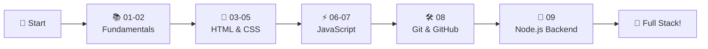

# ✅ Complete Web Development Step by Step - FINISHED! 🎉

<div align="center">


### 🌐 Complete Web Development Course

**From Frontend to Backend - Full Stack Journey**

[⭐ Star this Repo](https://github.com/ranichandnirani/Complete-Web-Development-step-by-step) • [🍴 Fork It](https://github.com/ranichandnirani/Complete-Web-Development-step-by-step/fork) • [📝 Report Issue](https://github.com/ranichandnirani/Complete-Web-Development-step-by-step/issues)

</div>

---

## 📌 About This Repository

This repository contains a **complete full-stack web development course** covering everything from HTML basics to backend development with Node.js. Each module includes hands-on projects, practical examples, and real-world applications.

**Perfect for:**

- 🎯 Absolute beginners starting web development
- 📚 Learning modern web technologies (HTML, CSS, JS, Tailwind)
- 💡 Building full-stack applications
- 🚀 Creating portfolio projects
- 📖 Mastering Git, GitHub, and deployment

---

## 🎯 Course Content Overview

### 🔰 Getting Started

| Module  | Topic                        | Content                  | Status |
| ------- | ---------------------------- | ------------------------ | ------ |
| **01** | Before Web Dev               | Prerequisites & Setup     | ✅     |
| **02** | Basics of Web Dev            | How Web Works, Internet   | ✅     |

### 🎨 Frontend Fundamentals

| Module  | Topic                        | Technologies             | Status |
| ------- | ---------------------------- | ------------------------ | ------ |
| **03** | HTML                          | Tags, Forms, Semantics   | ✅     |
| **04** | Learn CSS                     | Styling, Flexbox, Grid   | ✅     |
| **05** | Learn Tailwind                | Utility-first CSS        | ✅     |

### ⚡ JavaScript & Interactivity

| Module  | Topic                        | Content                  | Status |
| ------- | ---------------------------- | ------------------------ | ------ |
| **06** | Learn JS Foundation           | ES6+, DOM, Events        | ✅     |
| **07** | JS Projects                   | Real-world Applications  | ✅     |

### 🛠️ Tools & Version Control

| Module  | Topic                        | Content                  | Status |
| ------- | ---------------------------- | ------------------------ | ------ |
| **08** | Git & GitHub                  | Version Control Mastery  | ✅     |

### 🔧 Backend Development

| Module  | Topic                        | Content                  | Status |
| ------- | ---------------------------- | ------------------------ | ------ |
| **09** | Backend with Node.js          | File Handling, Projects  | ✅     |

---

## 🚀 Quick Start

### Prerequisites

```bash
✅ Web Browser (Chrome, Firefox, Edge)
✅ Code Editor (VS Code recommended)
✅ Node.js & npm (for backend modules)
✅ Git installed on your system
```

### Installation & Usage

```bash
# Clone the repository
git clone https://github.com/ranichandnirani/Complete-Web-Development-step-by-step.git

# Navigate to the folder
cd Complete-Web-Development-step-by-step

# Choose any module (example: 03_HTML)
cd "03_HTML"

# Open index.html in browser
# Or use Live Server extension in VS Code
```

---

## 📂 Repository Structure

```
📦 Complete Web Development
├── 📁 01_Before web-dev
│   └── Introduction & Prerequisites
├── 📁 02_Basic of web-dev
│   └── How the Web Works
├── 📁 03_HTML
│   └── HTML5 Fundamentals
├── 📁 04_Learn CSS
│   └── CSS3 & Styling
├── 📁 05_Learn Tailwind
│   └── Tailwind CSS Framework
├── 📁 06_Learn JS
│   └── JavaScript Foundation
├── 📁 07_JS-Projects
│   └── JavaScript Applications
├── 📁 08_Git and Github-master version control
│   └── Git & GitHub Workflows
└── 📁 09_Backend with NodeJS and Projects
    └── Node.js & File Handling
```

---

## 💡 Key Learning Highlights

### 🎯 What's Covered

✨ **Frontend Technologies**

- HTML5 (Semantic HTML, Forms, Multimedia)
- CSS3 (Flexbox, Grid, Animations, Responsive Design)
- Tailwind CSS (Utility-first approach)
- Modern JavaScript (ES6+, Async/Await, Promises)
- DOM Manipulation & Event Handling

🔥 **Backend & Tools**

- Node.js Fundamentals
- File System Operations
- Git & GitHub (Version Control)
- Project Deployment
- Backend API Development

🏆 **Real-World Skills**

- Building Responsive Websites
- Interactive Web Applications
- Version Control with Git
- Backend Development
- Full-Stack Project Creation

🚀 **Practical Projects**

- JavaScript Mini Projects
- Interactive Web Apps
- Node.js File Management
- Real-world Implementations

---

## 🎓 Learning Path



---

## 📖 Detailed Modules

<details>
<summary>📚 <b>Module 01: Before Web Dev</b></summary>

- What is Web Development?
- Frontend vs Backend
- Tools & Setup
- Environment Configuration
- Career Paths in Web Dev
</details>

<details>
<summary>🌐 <b>Module 02: Basics of Web Dev</b></summary>

- How the Internet Works
- Client-Server Architecture
- HTTP/HTTPS Protocols
- Domain Names & Hosting
- Web Development Fundamentals
</details>

<details>
<summary>📝 <b>Module 03: HTML</b></summary>

- HTML5 Structure
- Semantic HTML
- Forms & Input Types
- Tables & Lists
- Multimedia Elements
- Accessibility Best Practices
</details>

<details>
<summary>🎨 <b>Module 04: Learn CSS</b></summary>

- CSS Syntax & Selectors
- Box Model
- Flexbox Layout
- CSS Grid
- Responsive Design
- Animations & Transitions
- Media Queries
- CSS Variables
</details>

<details>
<summary>⚡ <b>Module 05: Learn Tailwind</b></summary>

- Tailwind CSS Installation
- Utility-First Approach
- Responsive Design with Tailwind
- Custom Configurations
- Component Building
- Best Practices
</details>

<details>
<summary>💻 <b>Module 06: Learn JavaScript</b></summary>

- JavaScript Basics
- ES6+ Features
- Variables & Data Types
- Functions & Arrow Functions
- DOM Manipulation
- Event Handling
- Async JavaScript
- Promises & Async/Await
- Local Storage
</details>

<details>
<summary>🚀 <b>Module 07: JS Projects</b></summary>

- Interactive Web Apps
- Mini Projects
- Real-world Applications
- Problem Solving
- Project-based Learning
</details>

<details>
<summary>🛠️ <b>Module 08: Git & GitHub</b></summary>

- Git Basics
- Repository Management
- Branches & Merging
- Pull Requests
- Collaboration Workflows
- GitHub Pages Deployment
- Version Control Best Practices
</details>

<details>
<summary>🔧 <b>Module 09: Backend with Node.js</b></summary>

- Node.js Introduction
- File System Module
- Creating Server
- Handling Files
- Backend Projects
- API Fundamentals
</details>

---

## 🤝 Contributing

Contributions are welcome! Here's how you can help:

1. 🍴 Fork the repository
2. 🌿 Create a feature branch (`git checkout -b feature/AmazingFeature`)
3. ✍️ Commit your changes (`git commit -m 'Add some feature'`)
4. 📤 Push to the branch (`git push origin feature/AmazingFeature`)
5. 🔃 Open a Pull Request

**Contribution Ideas:**

- 🐛 Fix bugs or typos
- ✨ Add more projects
- 📝 Improve documentation
- 💡 Share best practices
- 🎯 Add code comments

---

## 📚 Useful Resources

### Official Documentation

- [📖 MDN Web Docs](https://developer.mozilla.org/)
- [🎨 CSS-Tricks](https://css-tricks.com/)
- [⚡ JavaScript.info](https://javascript.info/)
- [🎯 Tailwind CSS Docs](https://tailwindcss.com/docs)
- [🟢 Node.js Docs](https://nodejs.org/docs/)

### Learning Platforms

- [💻 freeCodeCamp](https://www.freecodecamp.org/)
- [📚 W3Schools](https://www.w3schools.com/)
- [🎥 Web Dev Simplified](https://www.youtube.com/@WebDevSimplified)
- [📖 The Odin Project](https://www.theodinproject.com/)

### Practice & Tools

- [🎯 Frontend Mentor](https://www.frontendmentor.io/)
- [💪 CodePen](https://codepen.io/)
- [🏆 DevChallenges](https://devchallenges.io/)
- [🎨 Dribbble (Design)](https://dribbble.com/)

### Video Tutorials

- [🎥 Traversy Media](https://www.youtube.com/@TraversyMedia)
- [🎬 The Net Ninja](https://www.youtube.com/@NetNinja)
- [📺 Fireship](https://www.youtube.com/@Fireship)

---

## 🌟 Features

- ✅ **9 Comprehensive Modules**: From basics to backend
- ✅ **Hands-on Projects**: Real-world applications
- ✅ **Modern Technologies**: HTML5, CSS3, ES6+, Tailwind, Node.js
- ✅ **Version Control**: Complete Git & GitHub guide
- ✅ **Full-Stack Coverage**: Frontend + Backend
- ✅ **Clean Code**: Well-structured examples
- ✅ **Progressive Learning**: Step-by-step approach
- ✅ **Portfolio Ready**: Build deployable projects

---

## 📊 Course Statistics

```
📚 Total Modules: 9
💻 Technologies: 5+ (HTML, CSS, JS, Tailwind, Node.js)
🎯 Projects: 10+
🎨 Languages: HTML (41.8%), JavaScript (30.2%), CSS (25.3%)
⏱️ Estimated Time: 100-120 hours
🎓 Difficulty: Beginner to Intermediate
🌐 Type: Full-Stack Web Development
```

---

## 🎯 Learning Outcomes

After completing this course, you will be able to:

✅ Build responsive websites from scratch  
✅ Create interactive web applications with JavaScript  
✅ Use modern CSS frameworks like Tailwind  
✅ Develop backend applications with Node.js  
✅ Master Git & GitHub for version control  
✅ Deploy projects to the web  
✅ Build a professional portfolio  
✅ Work on real-world web projects  

---

## 📄 License

This project is licensed under the **MIT License** - feel free to use for learning and teaching!

[](LICENSE)

---

## 🌟 Show Your Support

If this repository helped you learn web development:

⭐ **Star** this repository  
🍴 **Fork** for your reference  
📢 **Share** with fellow learners  
🤝 **Contribute** to improve it  

---

## 🔗 Connect With Me

<div align="center">

[](https://github.com/ranichandnirani)
</div>

---

## 💬 Support

Need help or have questions?

- 💡 [Open an Issue](https://github.com/ranichandnirani/Complete-Web-Development-step-by-step/issues)
- 📧 Email: chandnirani229@gmail.com
- 🌐 GitHub: [@ranichandnirani](https://github.com/ranichandnirani)

---

<div align="center">

### 🎉 Course Completed Successfully! 🎉

**Made with ❤️ and ☕ for Web Developers**

_Happy Coding! Keep Learning, Keep Building!_ 💻✨

---


**⭐ If this helped you, please star this repository! ⭐**

</div>